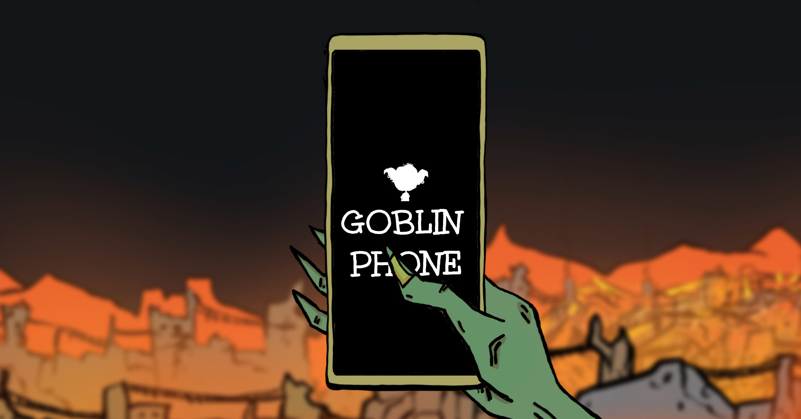

<p align="center">
  <a href="https://goblinphone.xyz" target="_blank"></a>
</p>
<h1 align="center">
  Goblin Phone
</h1>

<p align="center">
A <a href="https://twitter.com/goblintown" target="_blank">goblintown.wtf</a> & <a href="https://twitter.com/goblingrlzwtf" target="_blank">goblingrlz.wtf</a> derivative website project
</p>

## Requirements

- [Node.js](https://nodejs.org/en/) >=18

## Development

1. Install project dependencies:
   ```
   pnpm i
   ```
2. Copy the `.env.example` file as `.env` and provide [required environment variables](#list-of-required-environment-variables).
3. Run the application in the development mode:
   ```
   pnpm run dev
   ```

## Deployment

#### Using providers with SvelteKit support

1. Deploy the application using the provider of your preference with SvelteKit support.
2. Provide [required environment variables](#list-of-required-environment-variables) in the provider's settings.

#### Self-hosting

1. Set up [required environment variables](#list-of-required-environment-variables).
2. Follow the SvelteKit's [node server deployment documentation](https://kit.svelte.dev/docs/adapter-node).

## Guides

#### Obtaining Twitter API token

1. Sign up for a Twitter developer account and create a new app ([official guide](https://developer.twitter.com/en/docs/twitter-api/getting-started/getting-access-to-the-twitter-api)).
2. Generate a Bearer Token ([official guide](https://developer.twitter.com/en/docs/authentication/oauth-2-0/bearer-tokens)).

#### List of required environment variables

- `TWITTER_API_TOKEN`

## License

The codebase and assets are licensed under [CC0](https://creativecommons.org/publicdomain/zero/1.0/deed), except for audio-related assets (located in `static/assets/audio` and `static/assets/images/applications/goblify/covers`) and font files (located in `static/fonts`) which are copyright of their respective owners.
